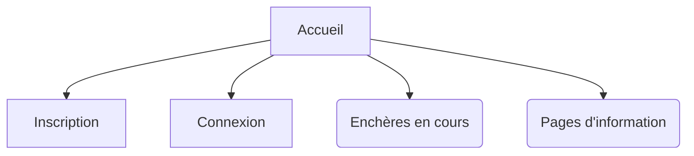
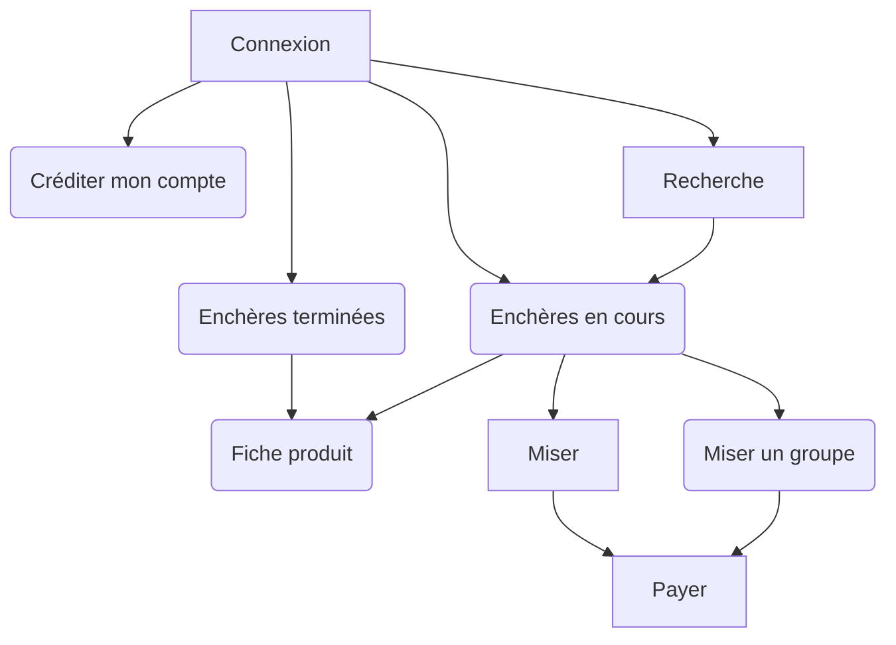
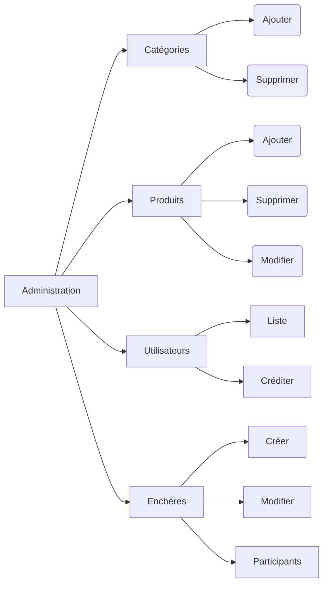

# Site d'enchères inversées - Spécifications fonctionnelles

Dans le cadre de ce projet, le développement sera effectué en suivant la méthode agile, et chaque itération (sprint) donnera lieu à une livraison et une phase de recette par le client.

## Définition du besoin

Un site d'enchères inversées est un jeu d'argent où les joueurs parient sur un objet.

Le but du pari est de deviner si le joueur va être le seul à parier un montant qu'il est prêt à payer pour obtenir l'objet. Si le joueur est le seul à avoir parié ce montant et que c'est le montant le plus bas avec un seul pari, alors le joueur gagne.

Exemple : un téléphone est mis en jeu. L'utilisateur A parie les montants de 1 €, 2 € et 3 €. L'utilisateur B parie les montants de 1 € à 5 €. L'utilisateur C parie les montants de 5 et 6 €. Si aucun autre pari (ou mise) n'a été fait, à la clôture de l'enchère c'est l'utilisateur B qui gagnera et devra régler la somme de 4 € pour recevoir le téléphone.

|Montant | Joueurs | Gagnant ?
|--|--|--|
| 1 € | A, B | Non |
| 2 € | A, B | Non |
| 3 € | A, B | Non |
| 4 € | B | Oui, mise unique la plus basse |
| 5 € | B, C | Non |
| 6 € | C | Non, mise unique, mais pas la plus basse |

Dans le cadre de notre site d'enchères inversées, les joueurs doivent savoir si leur mise est la mise unique la plus basse, ou non, afin de les inciter à jouer davantage.

De même les joueurs doivent pouvoir miser sur toute une plage de montants en une seule fois (par exemple tous les montants entre 1 et 2 €, au centime près).

Lorsqu'il a remporté l'enchère, l'utilisateur passe à un système proche d'un site de e-commerce classique, où il doit indiquer son adresse de livraison et régler le montant de l'objet.

Chaque mise devra faire l'objet d'un coût (déterminé par enchère), qui sera débité sur le compte du client.

## Fonctionnalités

### Site public

Les utilisateurs non connectés devront pouvoir accéder à :

* la liste des enchères en cours et passées
* des pages d'information statiques (comment ça marche, aide, contact, mentions légales
* le formulaire d'inscription
* le formulaire de connexion

### Utilisateurs connectés

Les utilisateurs connectés eux devront avoir accès à ces fonctionnalités après connexion :
* Créditer le compte
* Déconnexion
* Rechercher dans les produits en vente
* Liste des enchères terminées
* Liste des enchères en cours
  * Fiche produit
  * Déposer une mise
  * Payer une mise

### Administration

Les administrateurs doivent pouvoir accéder aux fonctions suivantes

* Catégorie de produits : lister, ajouter, supprimer
* Produits : lister, ajouter, supprimer, renseigner les détails, ajouter et supprimer des images
* Utilisateurs : lister, supprimer, créditer le compte d'un utilisateur
* Enchères :
  * Créer une nouvelle enchère
  * Lister les enchères en cours
  * Clôturer ou modifier une enchère en cours
  * Informations (gagnant, participants) sur une enchère en cours ou terminée

### Détails des droits utilisateurs

|Fonctionnalité| Anonyme | Connecté | Admin |
|--|--|--|--|
| Pages statiques | Oui | Oui | Oui |
| Connexion | Oui | -- | -- |
| Inscription | Oui | -- | -- |
| Voir les enchères terminées | Oui | Oui | Oui || Créditer son compte | -- | Oui | Oui |
| Déconnexion | -- | Oui | Oui |
| Faire des mises | -- | Oui | Oui |
| Voir les enchères en cours | -- | Oui | Oui |
| Rechercher dans les enchères | -- | Oui | Oui |
| Administrer les mises et contenus | -- | -- | Oui |

### Ergonomie

Le site doit être simple, léger, rapide et performant afin que les utilisateurs puissent parier rapidement.

#### Formulaires

Les formulaires doivent suivre l'ergonomie et l'UI du client, sans imposer de style particulier.

## Sprint n°1 (deadline : 1er avril 2019)

Les user stories suivantes seront réalisées dans le cadre de cette première itération :

1. En tant que **visiteur** je veux comprendre ce qu'est ce site pour savoir si je suis intéressé.
2. En tant que **visiteur** je veux voir les **enchères en cours** pour savoir si les produits m'intéressent.
3. En tant que **visiteur** je veux pouvoir **m'inscrire** pour participer.
4. En tant **qu'utilisateur** je veux pouvoir lire la FAQ pour avoir des réponses à mes questions.
5. En tant que **visiteur** je veux pouvoir me connecter pour pouvoir participer.
6. En tant qu'**utilisateur connecté** je veux pouvoir **consulter mon compte et voir mon crédit**.
7. En tant qu'**utilisateur connecté** je veux pouvoir **ajouter des crédits** à mon compte.
8. En tant qu'**utilisateur connecté** je peux **déposer une mise** ou une plage de mises sur une enchère en cours.
9. En tant qu'**utilisateur connecté** je peux **voir les mises que j'ai déposées** sur une enchère et savoir si une de mes mises est gagnante.
10. En tant qu'**administrateur** je peux **ajouter et supprimer des catégories de produits**.
11. En tant qu'**administrateur** je peux **ajouter et supprimer des produits**.
12. En tant qu'**administrateur** je peux **ajouter et supprimer des images sur une fiche produit**.
13. En tant qu'**administrateur** je peux **choisir une image comme étant l'image principale** d'un produit, qui sera affichée dans les listes d'enchères.
14. En tant qu'**administrateur** je peux renseigner les **détails** (caractéristiques) d'un produit*
15. En tant qu'**administrateur** je peux **créer, modifier et supprimer des enchères** sur des produits.
16. En tant qu'**administrateur** je peux voir les mises effectuées sur une enchère.

### En tant que **visiteur** je veux comprendre ce qu'est ce site pour savoir si je suis intéressé.

ÉTANT DONNÉ que je suis sur la page d'accueil du site
QUAND j'arrive sur le site
ALORS je lis un texte d'introduction décrivant le site succinctement.

### En tant que **visiteur** je veux voir les **enchères en cours** pour savoir si les produits m'intéressent.

ÉTANT DONNÉ que je suis sur la page d'accueil du site
QUAND je clique sur "Enchères en cours"
ALORS une liste de produits en cours d'enchères s'affiche.

### En tant **que visiteur** je veux pouvoir lire la FAQ pour avoir des réponses à mes questions.

ÉTANT DONNÉ que je suis sur la page d'accueil du site
QUAND je clique sur "Comment ça marche ?"
ALORS une liste de questions et réponses s'affiche.

### En tant que **visiteur** je veux pouvoir **m'inscrire** pour participer.

ÉTANT DONNÉ que je suis sur la page "Inscription"
ET que je renseigne une adresse e-mail
ET que je renseigne un mot de passe
QUAND je clique sur "M'inscrire"
ALORS mon compte est créé et je suis connecté.

### En tant que **visiteur** je veux pouvoir me connecter pour pouvoir participer.

ÉTANT DONNÉ que je suis sur la page de connexion
QUAND je remplis mon adresse e-mail
ET que je remplis mon mot de passe
ET que je clique sur le bouton "Connexion"
ALORS je suis connecté et redirigé vers la page d'accueil.

### En tant qu'**utilisateur connecté** je veux pouvoir **consulter mon compte et voir mon crédit**.

ÉTANT DONNÉ que je suis connecté
QUAND je clique sur "Mon compte"
ALORS s'affiche une page indiquant mes informations personnelles et mon solde de crédit.

### En tant qu'**utilisateur connecté** je veux pouvoir **ajouter des crédits** à mon compte.

ÉTANT DONNÉ que je suis connecté et sur la page "Mon compte"
QUAND je renseigne un montant 
ET que je clique sur le bouton "Créditer mon compte"
ALORS ce montant est ajouté à mon solde de crédit.

### En tant qu'**utilisateur connecté** je peux **déposer une mise** ou une plage de mises sur une enchère en cours.

ÉTANT DONNÉ que je suis connecté et sur la page d'une enchère
QUAND je renseigne une plage de mises
ET que je clique sur 
ALORS chacune des mises de la plage renseignée est placée sur cette enchère
SI mon crédit est suffisant.

### En tant qu'**utilisateur connecté** je peux **voir les mises que j'ai déposées** sur une enchère et savoir si une de mes mises est gagnante.

ÉTANT DONNÉ que je suis connecté
QUAND je vais sur la page d'une enchère à laquelle j'ai participé
ALORS s'affiche la liste des mises que j'ai effectuées et si celles-ci sont uniques ou non.

### En tant qu'**administrateur** je peux **ajouter et supprimer des catégories de produits**.

ÉTANT DONNÉ que je suis connecté avec un compte administrateur
QUAND je clique sur "Admin"
ET que je clique sur "Catégories"
ALORS s'affiche une page listant les catégories de produit, me permettant de les supprimer ou d'en ajouter une nouvelle.

### En tant qu'**administrateur** je peux **ajouter et supprimer des produits**.

ÉTANT DONNÉ que je suis connecté avec un compte administrateur
QUAND je clique sur "Admin"
ET que je clique sur "Produits"
ALORS s'affiche une page listant les produits, me permettant de les supprimer ou d'en ajouter un nouveau.

### En tant qu'**administrateur** je peux **ajouter et supprimer des images sur une fiche produit**.

ÉTANT DONNÉ que je suis connecté avec un compte administrateur
QUAND je clique sur "Admin"
ET que je clique sur "Produits"
ET que je clique sur le nom d'un produit
ALORS s'affiche une page listant les images associées au produit, me permettant de les supprimer ou d'en ajouter une nouvelle.

### En tant qu'**administrateur** je peux **choisir une image comme étant l'image principale** d'un produit, qui sera affichée dans les listes d'enchères.

ÉTANT DONNÉ que je suis connecté avec un compte administrateur
QUAND je clique sur "Admin"
ET que je clique sur "Produits"
ET que je clique sur le nom d'un produit
ALORS s'affiche une page listant les images associées au produit, me permettant de voir celle qui est actuellement affichée dans les listes de produits et d'enchères, et d'en choisir une autre.

### En tant qu'**administrateur** je peux renseigner les **détails** (caractéristiques) d'un produit*

ÉTANT DONNÉ que je suis connecté avec un compte administrateur
QUAND je clique sur "Admin"
ET que je clique sur "Produits"
ET que je clique sur le nom d'un produit
ALORS s'affiche une page listant les caractéristiques d'un produit et me permettant d'en ajouter de nouvelles.

### En tant qu'**administrateur** je peux **créer, modifier et supprimer des enchères** sur des produits.

ÉTANT DONNÉ que je suis connecté avec un compte administrateur
QUAND je clique sur "Admin"
ET que je clique sur "Enchères"
ALORS s'affiche une page listant les enchères existantes et me permettant de les supprimer ou d'en créer une nouvelle.

### En tant qu'**administrateur** je peux voir les mises effectuées sur une enchère.

ÉTANT DONNÉ que je suis connecté avec un compte administrateur
QUAND je clique sur "Admin"
ET que je clique sur "Enchères"
ET que je clique sur une enchère
ALORS s'affiche une page listant les mises actuellement faites sur cette enchère.

## User stories à réaliser sur le sprint n°2

1. En tant qu'**administrateur** je peux voir les statistiques (gains, nombre de mises) sur une enchère.
2. En tant qu'**utilisateur** je peux rechercher un produit par mot-clé (recherche fulltext).
3. En tant qu'**utilisateur** je peux indiquer mon nom et mon adresse dans mon profil.
4. En tant qu'**utilisateur** je peux payer lorsque je remporte une enchère.
5. En tant qu'**utilisateur** je peux payer pour créditer mon compte.
6. En tant qu'**administrateur** je peux ajouter, modifier et supprimer des caractéristiques possibles selon les catégories de produits
7. En tant qu'**administrateur** une confirmation m'est demandée avant de supprimer un produit, une catégorie, une image ou une enchère.

## User stories à réaliser sur le sprint n°3

1. En tant qu'utilisateur je veux recevoir une notification par e-mail quand je remporte une enchère.
2. En tant qu'utilisateur je reçois une notification par e-mail une heure avant la clôture de l'enchère m'indiquant si ma mise est gagnante ou non.
3. En tant qu'administrateur, je peux configurer une enchère pour qu'elle s'arrête automatiquement lorsqu'un seuil de rentabilité est atteint.
4. En tant qu'administrateur je peux lister, gérer le profil et voir les mises des utilisateurs inscrits.
